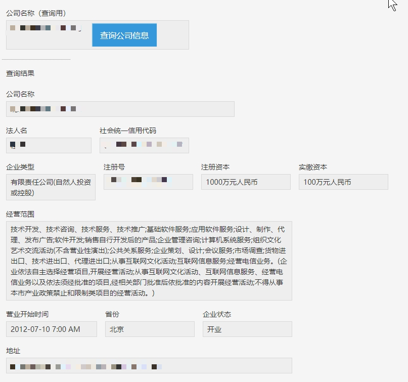

# 企业信息查询插件
## 概要
在商业活动中，我们有时候需要查询对方企业的商业信息。
市面上也有好多提供这方面服务的服务商。
下面我们以【天眼查】和【企查查】为例，一起来制作一款可以实现此功能的插件。
## 完成后的样子

## 账号准备
### 注册
不管是【天眼查】还是【企查查】，我们都需要先注册，才能调用他们的API。打开下面的链接进行注册。
[天眼查](https://open.tianyancha.com/api_list)
[企查查](https://openapi.qcc.com/data)
###凭证保存
完成注册后,会得到以下信息作为API调用的凭证，查看后请妥善保存。
**天眼查**
- Token

**企查查**
- 接口Key
- 接口密钥

### 特别注意
在调试API过程中，有可能会产生相应费用，收费规则请用户自行查询相应的服务商，事先把握好费用控制，以避免不必要的花费。如产生意料外的收费，本教程概不负责。

## 下载源码，打包，导入
为了方便之后的自定义开发，建议您下载[源代码](https://gitee.com/cybozudeveloper/kintone-company-info-plugin)后自行打包上传。
下载源码后,进入命令行控制台，在源码的根目录处，键入以下命令
1. 下载依赖库
`$npm install`
2. webpack打包
`$npm run prod:webpack`

然后就可以正常的进行插件的打包作业了。

如果只是想试用，可以直接下载{{打包文件}}
有关打包和导入的方法，可参见[kintone 插件开发流程](https://cybozudev.kf5.com/hc/kb/article/1000664/)中的打包导入章节。

