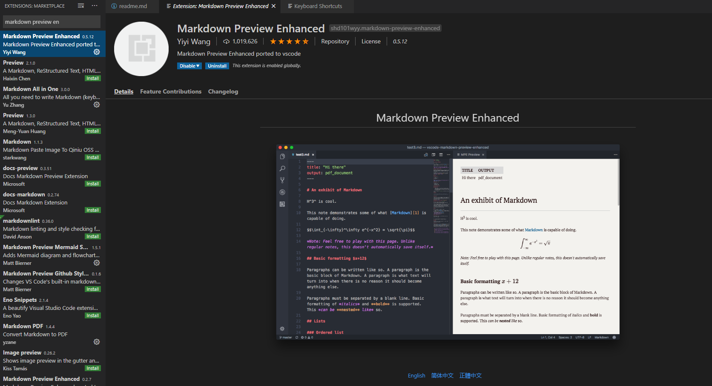
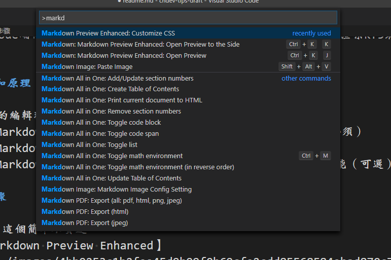

### 简介
本篇文章是介绍如何在本地编辑kf5网站上的文档。

### 背景
在cndev的日常编辑文档工作中，我们有一些困扰或者说是不便。如：

- kf5的富文本编辑器不太好用，例如工具条在滚动时会自动隐藏，想要再显示要按一下“上”键。
- 每个段落每个标题都用工具条刷格式太过繁琐。
- 自动保存有可能会不经意间保存不想要的版本。
- kf5有文本上限，如超出上限还在增加编辑保存时会丢失超出部分，造成损失。
- 共用账号被踢下线可能有正在编辑的文档未保存。

### 本地编辑的想法
我想出了依托vscode编辑器的强大功能，用markdown语法来写本地草稿，并实时渲染kf5最终成果的html效果。这样可以一并解决上述困扰。

### 需要的东西和原理

- vscode: 整个的编辑环境（必须）
- vscode插件【Markdown Preview Enhanced】: 把markdown渲染成html（必须）
- vscode插件【Markdown Image】: 方便贴图（可选）
- vscode插件【Markdown All in One】: markdown编辑时的一些基础辅助功能（可选）

### 环境准备步骤

1. 安装vscode，这个简单不赘述
2. 安装插件【Markdown Preview Enhanced】

3. ctrl + alt + p 调出命令面板
4. 输入 Markdown Preview Enhanced: Customize CSS 其中的几个字符，找到这条命令后回车

5. 发现打开了一个叫style.less的文件，这个就是负责渲染css的。
6. 打开我已经预先编辑好的[格式文件](https://raw.githubusercontent.com/forestsheep911/cndev-tips-draft/master/general/kf5.less), 拷贝全部内容拷贝到style.less后保存。
7. 随便建一个工作用的文件夹，在下面编辑一个markdown文件。
8. 写好markdown之后，右键文本区域，选择【Markdown Preview Enhanced: Open Preview to the Side】,双屏同步预览完美呈现。
