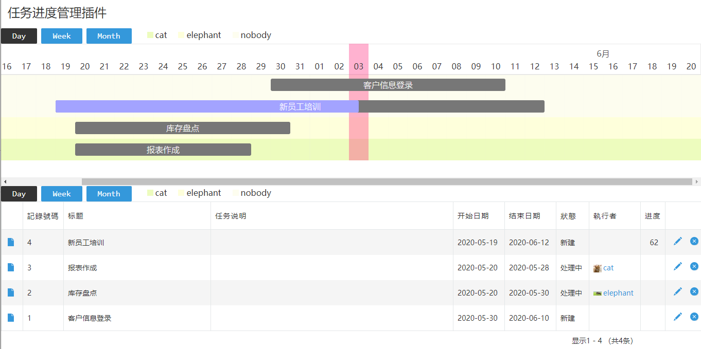
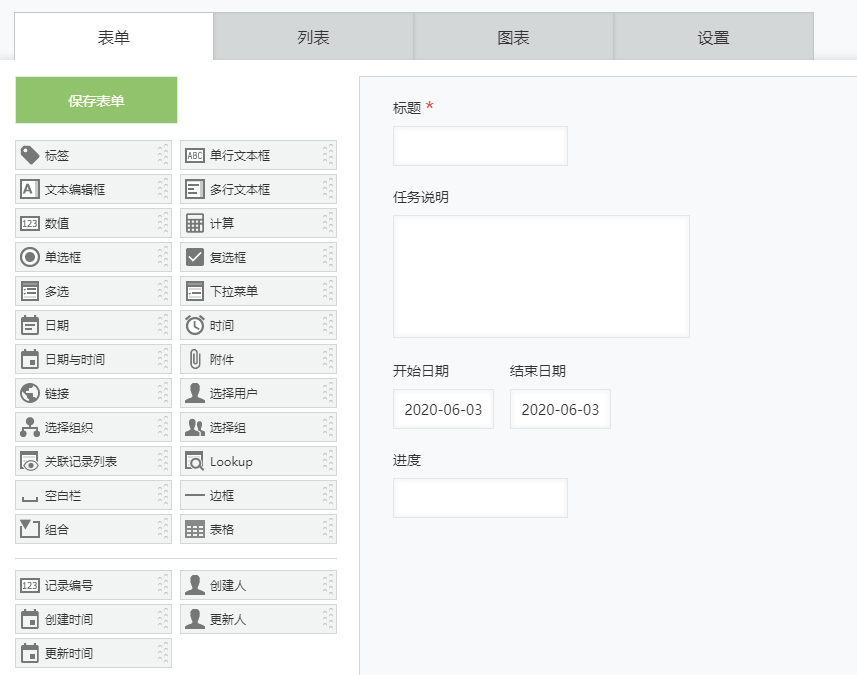
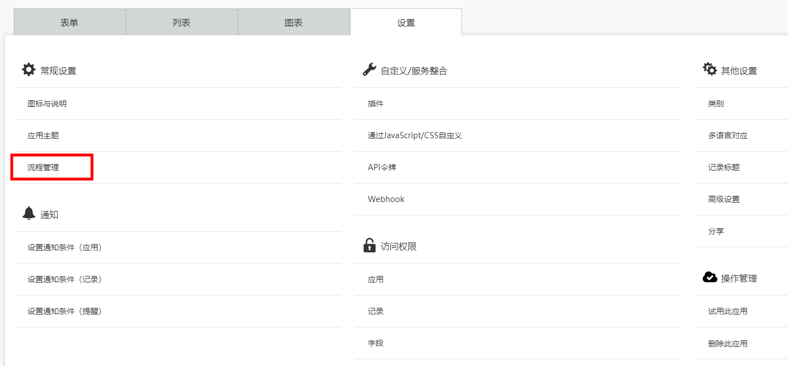
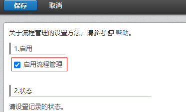
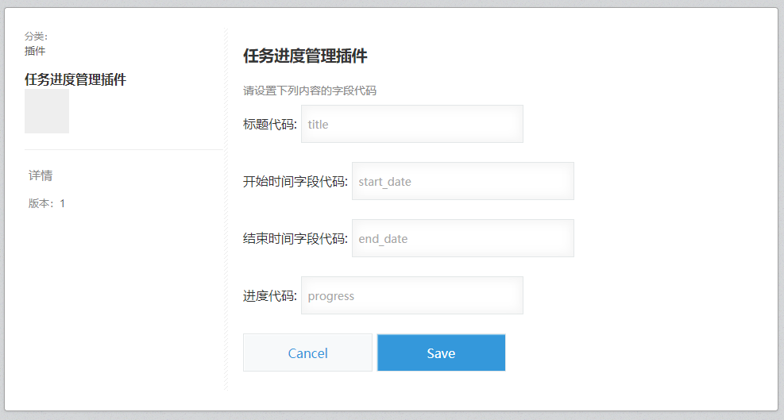

# 制作可调日期的任务甘特图

## 概要
之前我们介绍过一篇[甘特图插件](),这次我们要介绍的是另一款甘特图（使用了[frappe-gantt](https://github.com/frappe/gantt)）。与之前相比，这次最大的不同在于日期可以在图形界面上直接拖动来修改。而且还提供进度的管理。

如果您喜欢这些新功能，或是喜欢这款的UI风格，我们推荐您不妨尝试一下。

## 完成后的样子
下面是使用这个插件后，应用上显示的样子。
根据记录列表里的记录数据来显示甘特图。
  


## 下载源码，打包，导入
为了方便之后的自定义开发，建议您下载源码后自行打包上传。

这里是[下载地址](git)

有关打包和导入的方法，可参见[kintone 插件开发流程]()的打包中的导入章节。

## 应用的准备
### 创建一个Task管理的应用。应用本身非常简单，我们依照最低需求按下表中的字段创建应用

|字段名|类型|code|备注|
|---|---|---|---|
|任务名称|单行文本框|title||
|开始日期|日期|start_date||
|结束日期|日期|end_date||
|进度|数值|progress|最小值为0；最大值为100|

表单设计效果大致如下
  

### 开启应用的流程管理
本范例可以根据流程的执行人分组显示，所以需要开启应用的流程管理。
  
  


流程的状态和执行动作可以根据情况自行设定。
本范例没有做这方面的功能。

### 插件配置
- 在设置中找到插件
- 按下添加插件，找到之前取名为（任务进度管理插件）的插件后添加
- 点击插件设置（插件的齿轮图标）
- 配置好相应的字段代码（刚才在建立字段时赋予的code）
- 点击Save保存




|配置名称|内容|
|---|---|
|标题代码|title|
|开始日期代码|start_date|
|结束日期代码|end_date|
|进度代码|progress|

到这一步为止应用和插件的配置全部完成，点击更新应用，并试着追加几条数据来看看效果吧。

## 插件源码的简单介绍

现在我们来看看各部分功能是如何实现的吧。

### 添加视图切换的按钮，用天视图按钮举例
```javascript
let ganttButtonElDayTop = document.createElement('button');
  ganttButtonElDayTop.innerHTML = 'Day';
  ganttButtonElDayTop.classList.add('gantt-date');
  ganttButtonElDayTop.onclick = () => {
    ganttChart.change_view_mode('Day');
  }
```

### 根据kintone的record制作图像用的任务object
```javascript
function makeTask(records, config) {
  let tasks = [];
  for (let i = 0; i < records.length; i++) {
    tasks.push({
      start: records[i][config.startDate].value,
      end: records[i][config.endDate].value,
      name: records[i][config.title].value,
      id: records[i].$id.value,
      progress: records[i][config.progress].value,
      assignee: getFirstAssigneeName(records[i])
    });
  }
  // 根据当前执行者排序
  tasks.sort((one, two) => {
    if (one.assignee < two.assignee) {
      return 1;
    } else {
      return -1;
    }
  })
  return tasks;
}
```

### 跟新开始和结束时间的方法
```javascript
function updateTaskDate(ko, rocodeId, startDate, endDate) {
  var params = {
    app: 60,
    id: rocodeId,
    record: {
      start_date: {
        value: startDate
      },
      end_date: {
        value: endDate
      }
    }
  };
  ko.api(ko.api.url('/k/v1/record', true), 'PUT', params).then(function (resp) {}, function (error) {});
}
```
更新进度的方法和上面类似，这里不赘述。

### 执行者名和颜色对应提示
```javascript
function unique(arr) {
  if (!Array.isArray(arr)) {
    console.log('type error!');
    return;
  }
  let arrry = [arr[0]];
  for (let i = 1; i < arr.length; i++) {
    if (arr[i].assignee !== arr[i - 1].assignee) {
      arrry.push(arr[i]);
    }
  }
  return arrry;
}
// 取得唯一的执行者
let uniChargeTasks = unique(tasks);
// 循环添加执行者的颜色
for (let i = 0; i < uniChargeTasks.length; i++) {
  let rectColor = document.createElement('div');
  rectColor.classList.add('fav-color');
  rectColor.classList.add(uniChargeTasks[i].assignee)
  let chargeName = document.createElement('span');
  chargeName.classList.add('charge-name');
  chargeName.innerText = uniChargeTasks[i].assignee;
  let rectColor2 = rectColor.cloneNode(true);
  let chargeName2 = chargeName.cloneNode(true);
  insertAfter(chargeName2, ganttButtonElMonthTop);
  insertAfter(rectColor2, ganttButtonElMonthTop);
  insertAfter(chargeName, ganttButtonElMonthBottom);
  insertAfter(rectColor, ganttButtonElMonthBottom);
}
```

### 显示甘特图
```javascript
let ganttChart = new Gantt('#gantt-target', tasks, {
    on_click: function (task) {
      console.log(task);
    },
    on_date_change: function (task, start, end) {
      let formatStart = start.Format('yyyy-MM-dd');
      let formatEnd = end.Format('yyyy-MM-dd');
      console.log(task, formatStart, formatEnd);
      updateTaskDate(kintone, task.id, formatStart, formatEnd);
    },
    on_progress_change: function (task, progress) {
      console.log(task, progress);
      updateTaskProgress(kintone, task.id, config.progress, progress);
    },
    on_view_change: function (mode) {
      if (mode === 'Day') {
        ganttButtonElDayTop.classList.add('button-selected');
        ganttButtonElDayBottom.classList.add('button-selected');
        ganttButtonElWeekTop.classList.remove('button-selected');
        ganttButtonElWeekBottom.classList.remove('button-selected');
        ganttButtonElMonthTop.classList.remove('button-selected');
        ganttButtonElMonthBottom.classList.remove('button-selected');
      } else if (mode === 'Week') {
        ganttButtonElDayTop.classList.remove('button-selected');
        ganttButtonElDayBottom.classList.remove('button-selected');
        ganttButtonElWeekTop.classList.add('button-selected');
        ganttButtonElWeekBottom.classList.add('button-selected');
        ganttButtonElMonthTop.classList.remove('button-selected');
        ganttButtonElMonthBottom.classList.remove('button-selected');
      } else if (mode === 'Month') {
        ganttButtonElDayTop.classList.remove('button-selected');
        ganttButtonElDayBottom.classList.remove('button-selected');
        ganttButtonElWeekTop.classList.remove('button-selected');
        ganttButtonElWeekBottom.classList.remove('button-selected');
        ganttButtonElMonthTop.classList.add('button-selected');
        ganttButtonElMonthBottom.classList.add('button-selected');
      } else if (mode === 'Year') {
        ganttButtonElDayTop.classList.remove('button-selected');
        ganttButtonElDayBottom.classList.remove('button-selected');
        ganttButtonElWeekTop.classList.remove('button-selected');
        ganttButtonElWeekBottom.classList.remove('button-selected');
        ganttButtonElMonthTop.classList.remove('button-selected');
        ganttButtonElMonthBottom.classList.remove('button-selected');
      }
    },
    bar_height: 24,
    view_mode: 'Day',
    language: 'zh'
  });
});
```

## 注意事项
- 此插件是用于演示如何开发插件的范例，才望子不予以保证可正常运行。
- 不对此范例提供技术支持。
- 此范例推荐在Chrome、firefox中使用，在其他浏览器中的行为可能有异常。
- kintone的插件功能只可在标准版使用，简易版不可使用这点请大家注意一下