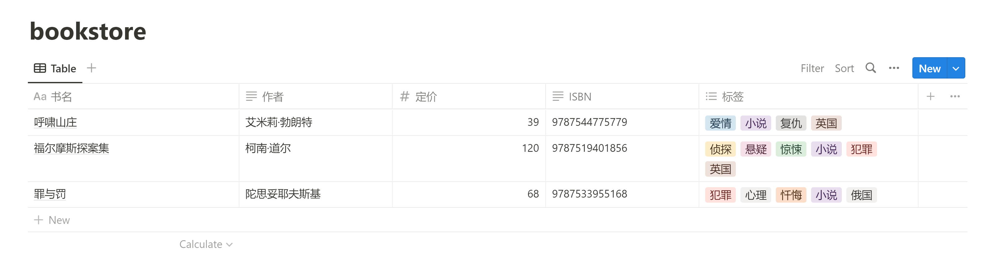
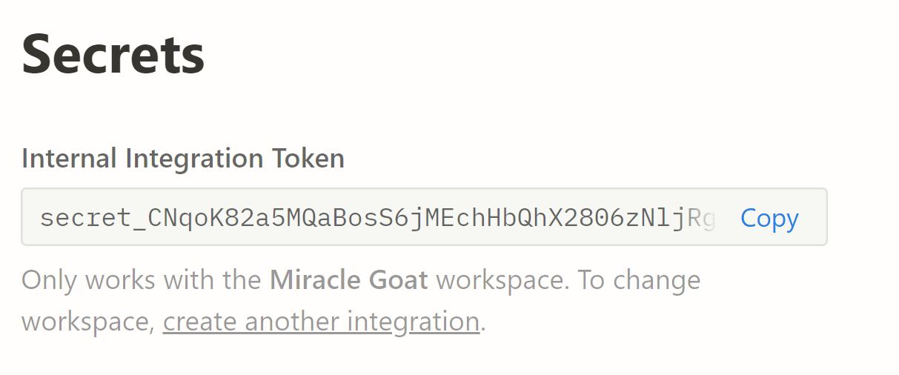
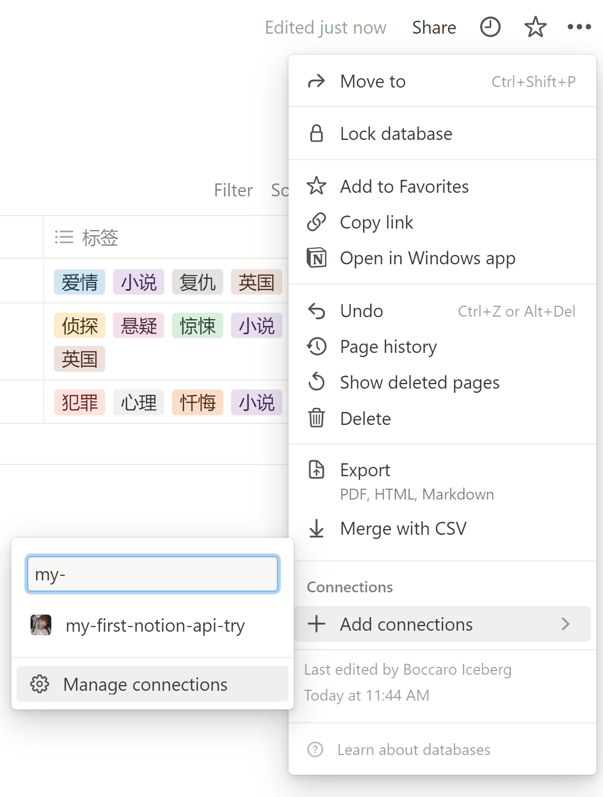
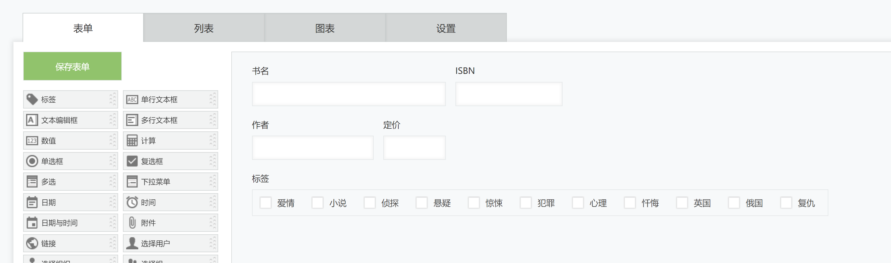
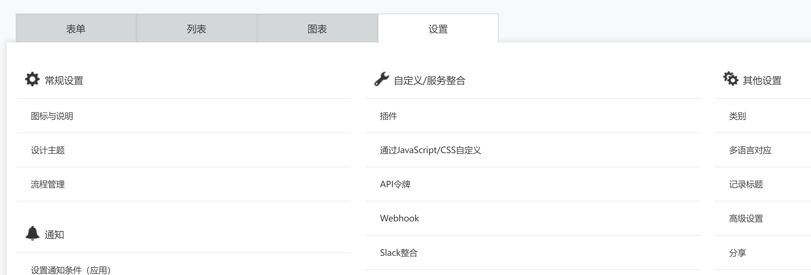

# 数据对接：从Notion Database到kintone App

## 前言

### Notion简介

近几年，有一款叫Notion的产品异常火爆，它是集笔记、任务管理、Wiki、数据管理为一体的产品，他主打两个理念「模块化」和「All-in-one」，Notion最有魅力的还是引进了Database和双向链的理念

Notion也算是一个渐进式的工具产品，渐进式你可以理解为，可以简单的当笔记工具用，也可以当个人或小团队的工作知识库和任务管理工具用。

### Notion与kintone

在实际使用Notion的过程中，我发现它的Database数据形式有着重要地位，它和Notion其他一些特色功能融合后，充分放大了其扩展性，自由性，和灵活性。Notion的Database属于关系型数据库的范畴，我不禁想到，关系型数据库的形式也是kintone App的核心内容，所以那他们之间一定是可以互通的。

今天我们就来探讨一下如何进行Notion和kintone之间的数据转换。

## 探讨范围

本着抛砖引玉的理念，本文想要做的更多是启发开发思路，而非那种可以拿来即用成熟产品。所以探讨和演示的范围不会面面俱到。

### 数据对接

说到数据对接，本应该是双向的，但本文只讨论Notion向kintone的单向转换。因为反向转换的话，完全可以反推出来，有需求的读者可以自行推演。

### 字段类型

Notion和kintone的二维结构表格中的字段，都有自己类型的设计，有相似的，也有不同的。本文中所演示的，只是一部分字段的转换，而且字段的对应关系也非严格匹配。读者可根据实际需求，或增加更多转换字段，或更改的字段类型对应关系。

譬如，Notion中的字段类型“Text”，其实技术上可以叫“RichText”（带丰富格式的文本），但我转换到kintone时，用的只是普通的“单行文本框”。

## 前期准备

### Notion方面的准备

- 在Notion中建立一个database，建立几个想要对接字段 。这里我建立了一个书店的表格。
- 要使用Notion的API，则先要创建一个integration。integration字面翻译叫做“融入”，这是Notion自己的叫法，我们可以简单理解为平时经常说的API Token。创建方式见[官方文档](https://www.notion.so/help/create-integrations-with-the-notion-api)。创建成功后你会得到一个Secrets字符串。 
- 有了integration之后，还要把它连接到刚才的database中，使得在调用API时，获得此database的访问权限。在最右上角的三个点图标中，找到Add connections，输入刚才的integration名，确认后连接成功。 

### kintone方面的准备

- 建立一个kintone App，用来接受Notion的database数据，所以字段类型必须选择合适的。 书名、ISBN、作者、可以选择单行文本框，定价选择数值，标签可以选择复选框或是多选。
- 给每个字段设置好字段代码，以备在程序中使用。我以json object的形式给出，属性名是字段名，属性值是字段代码，将来程序里能直接用得上。

  ```json
  {
    书名: 'book_name',
    ISBN: 'isbn',
    作者: 'author',
    定价: 'price',
    标签: 'label',
  }
  ```
- 创建token，以便将来程序中访问此App。 

  ### 程序编写运行环境方面
- 本文中所演示的代码，都是在nodejs的npm模式下编写调试的，我们也强烈建议您也在这种模式下来编写程序。而且我们将分别使用Notion和kintone的SDK，这种模式下引用库也会相对方便一些。下面是package.json文件的一部分相关设置，供您参考。

  ```json
  {
    "name": "notion2kintone",
    "version": "1.0.0",
    "type": "module",
    "dependencies": {
      "@kintone/rest-api-client": "^3.1.11",
      "@notionhq/client": "^2.1.1"
    }
  }
  ```

## 代码范例

```javascript
import { Client } from '@notionhq/client'
import { KintoneRestAPIClient } from '@kintone/rest-api-client'

// 用Notion的sdk创建一个客户端
const notion = new Client({ auth: 'secret_CNqoK82a5MQaBosS6jMEahHbQhX2806zNljRgShGuK' })

// 获取Notion数据
const iterateDB = async () => {
  // 获取Notion的database
  const dbArray = await notion.databases.query({ database_id: 'b269007a9a44488d9ff7fe0c646179c9' })
  // 获取database的属性
  const propertitsSet = await Promise.all(
    // database的每条记录是一个page，我们需要用它来获取每个属性
    dbArray.results.map(async (pageRecord) => {
      // 获取database的每一条记录
      const record = await Promise.all(
        // 遍历每条记录的每个属性名
        Object.keys(pageRecord.properties).map(async (propertyName) => {
          // 调用Notion的API，给出page id和属性id，拿到每条记录的每个属性值
          const propertyData = await notion.pages.properties.retrieve({
            page_id: pageRecord.id,
            property_id: pageRecord.properties[propertyName].id,
          })
          // 每条记录的Title，其实是在list下的，Text也是
          if (propertyData.object === 'list' && propertyData.results.length > 0) {
            if (propertyData.results[0].type === 'title') {
              return { [propertyName]: propertyData.results[0].title.plain_text }
            } else if (propertyData.results[0].type === 'rich_text') {
              return {
                [propertyName]: propertyData.results[0].rich_text.plain_text,
              }
            }
            // multi_select不会出现再list下，直接判断type就可以拿到
          } else if (propertyData.type === 'multi_select') {
            return {
              [propertyName]: propertyData.multi_select.map((p) => {
                return p.name
              }),
            }
            // number同multi_select
          } else if (propertyData.type === 'number') {
            return {
              [propertyName]: propertyData.number,
            }
          }
        }),
      )
      // 由于得到的record是数组，而在kintone中需要用对象来放置数据，所以这里先行做一个转换
      return { ...record }
    }),
  )
  return { records: propertitsSet }
}
const notionDBRecords = await iterateDB()

// Notion属性名和kintone App中字段代码的对应关系
const fieldCodeMap = {
  书名: 'book_name',
  ISBN: 'isbn',
  作者: 'author',
  定价: 'price',
  标签: 'label',
}
// 上传kintone的对象是有一定的格式要求，所以需要把数据加工一下
for (const record of notionDBRecords.records) {
  for (const [key, value] of Object.entries(record)) {
    if (value) {
      record[fieldCodeMap[Object.keys(value)[0]]] = { value: Object.values(value)[0] }
    }
    delete record[key]
  }
}
notionDBRecords.app = 
// 调用kintone sdk把数据添加到kintone
const client = new KintoneRestAPIClient({
  baseUrl: 'https://yourdomain.cybozu.cn',
  auth: {
    apiToken: 'WKuCUxqW8gRYrgs57w5UVAU9GUKYPaTU210MJ0bx',
  },
})
const kintoneResponse = await client.record.addRecords(notionDBRecords)
// 观察response来判断是否成功
console.log(kintoneResponse)

```

## 代码解析

整个代码的最粗的逻辑目标，就是从Notion中取出数据，存放到kintone中，这点是显而易见的。但实际观察代码，在获取Notion数据时，有很多遍历嵌套的结构，不免有些让人难以理解。所以在这里有必要做些说明。

### Notion获取database数据问题

造成遍历嵌套复杂的原因，是由于Notion API的规定所造成的。Notion在2022年6月28日之前的API版本中，支持用page id一次性获取所有属性。虽然很方便，但是由于性能等方面的原因，Notion开发团队在2022年6月28日之后的API版本中规定，获取page的属性，必须先获取属性名，再用page id和属性名去获取属性值。再加上page id需要给出database id后遍历得到，看上去结构就会更加繁琐。

具体信息可参考Notion的[Release note](https://developers.notion.com/changelog/releasing-notion-version-2022-06-28)，文中有“why page properties are so complex”这样的词句，可见开发团队本身就意识到了其复杂性会带来困扰。

虽然及其不推荐，但是还是有另一个办法。Notion在发送API时可以指定版本，我们可以发送类似2022-05-18这种之前的版本来规避这种复杂性。

### Notion Page属性数据结构不统一问题

另一个造成程序复杂的原因是Page属性的object组织结构并不统一，有几个属性（范例中的title和rich_text)并不放在外层，而是嵌套在list中。这就需要分情况判断了。具体信息可参考[属性对象](https://developers.notion.com/reference/property-item-object)，在处理数据时，这些情报非常重要。

### 范例中的“为了方便”

范例中的代码，有些地方是为了书写方便或是测试数据本身没有复杂结构等原因，没有很详细的把逻辑全面覆盖。

譬如26行等多出有`result[0]`的出现。

```javascript
if (propertyData.results[0].type === 'title') {
```

其实`results`的数组长度可不一定是1，因为像title这种数据类型可能是由多个富文本块所拼接构成。而每个富文本块还有他自己的一套格式数据。如果读者在实际编写中有需要解析这种数据的，请酌情把数据继续一层层解析下去，范例中就不赘述了。

### 机密情报

范例中的所有关键性隐私信息（secrets，token，appid等）均为假数据，读者测试时请使用自己的真实情报替换之。
